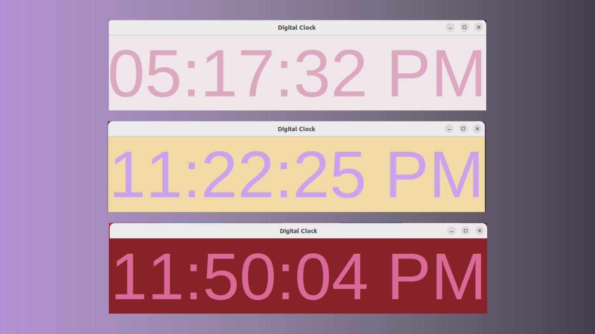
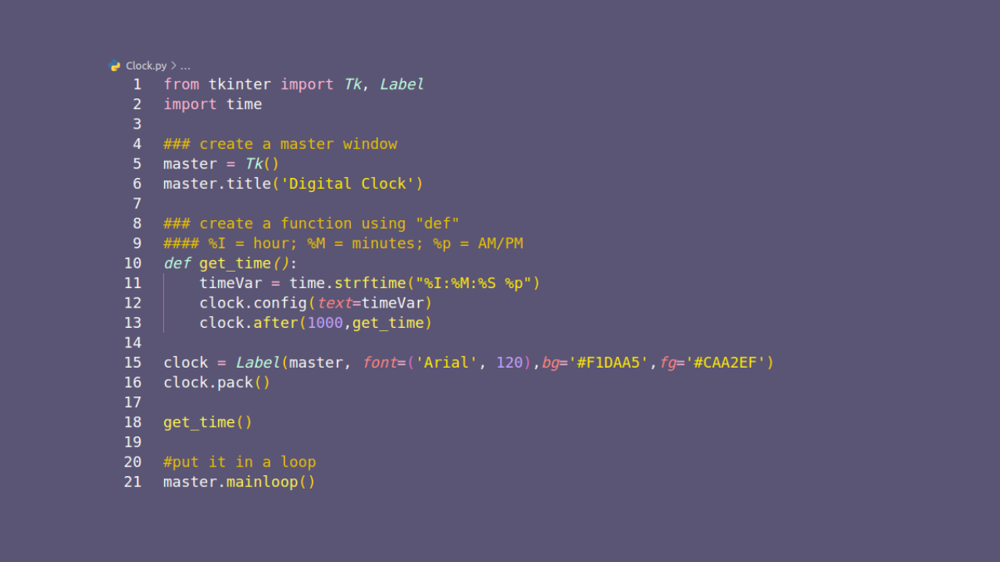

# **Digital Clock**


## **Project Overview**

In this application, we are going to create a simple Digital Clock using :<br>
**1. Label widget**<br>
**2. Tkinter** (GUI) <br>
**3. time module**  (to retrieve system’s time)

---
## **Prerequsite**

- Check if Tkinter is installed (usually comes along when we install Python)

---
## **What You Will Learn**
You will learn the following concepts & methods from this project: 

- **Tkinter & GUI**: A Python module that provides a set of tools to create graphical user interfaces (GUIs) for desktop applications.
- **time()** function: display the current time on the label widget
- **time.strftime()** method : retrieve system time.<br>
    
>**Syntax** :
```
{
  time.strftime(format[, t])
}
```

>**Directive** : 

>- %I - hour, using a 12-hour clock (01 to 12)
>- %M - minute
>- %M - minute
>- "am" or "pm" according to the given time value
- **config()** function : set the text of the label widget.
- **after()** function : display the time for 1000 milliseconds.
- **clock.pack()** : style of the label widget 
- **mainloop()** : an infinite loop used to run the application
---



